[/51](#51) - PoW 51% attack cost  
[/about](#about) - About the bot  
[/admin](#admin) - Administrate bot  
[/ath](#ath) - All Time High  
[/best](#best) - Best movers  
[/bpmn](#bpmn) - Command diagrams  
[/ch](#ch) - Price Change  
[/comp](#comp) - Compare currencies  
[/cs](#cs) - Candlestick chart  
[/c](#c) - Price and Volume chart  
[/de](#de) - Indicator for decentralization  
[/des](#des) - Currency description  
[/dev](#dev) - Development info  
[/donate](#donate) - Donate to bot development  
[/ev](#ev) - List global crypto events  
[/ex](#ex) - Exchange details & toplist  
[/feedback](#feedback) - Feedback  
[/g](#g) - Global stats  
[/help](#help) - List available commands  
[/ico](#ico) - Initial Coin Offering  
[/i](#i) - Technical coin info  
[/man](#man) - Show how to use a command  
[/mc](#mc) - Market Capitalization  
[/m](#m) - List coin markets  
[/n](#n) - Crypto news  
[/pe](#pe) - People in crypto  
[/p](#p) - Current price  
[/re](#re) - Send commands repeatedly  
[/restart](#restart) - Restart bot  
[/roi](#roi) - Return on Investment  
[/se](#se) - Coin search  
[/shutdown](#shutdown) - Shutdown bot  
[/soc](#soc) - Social links and stats  
[/s](#s) - Currency stats  
[/top](#top) - List top 30 coins  
[/tr](#tr) - Google Trends  
[/t](#t) - Team details  
[/tw](#tw) - Get newest Tweets  
[/update](#update) - Update bot  
[/vol](#vol) - Volume for a coin  
[/v](#v) - Value of coin quantity  
[/worst](#worst) - Worst movers  
[/wp](#wp) - Whitepaper download  

## `/51`

**Alternative commands**  
`/fiftyone`

**Description**  
Show informations about how much money you have to invest to get a 51% attack going on a specific PoW coin.

**Syntax**  
`/51 <symbol>`

**Examples**  
Show costs for a 51% attack at Bitcoin
`/51 btc`

## `/about`

**Alternative commands**  
None

**Description**  
Show informations about the author / developer of this Telegram bot and about the bot itself.

**Syntax**  
`/about`

**Examples**  
Show infos about bot and his creator  
`/about`

## `/admin`

**Alternative commands**  
None

**Description**  
This command will only work for bot adminstrators and allows to start, stop and reload plugins without restarting the bot itself, view bot stats, send global messages to every previous user of the bot, execute raw SQL statements and change the bot configuration.

**Syntax**  
`/admin (sql <statement>) [or] (cfg <key> [...] <value>) [or] (msg <message>) [or] (plg load [or] unload <plugin>)`

**Examples**  
Show different stats  
`/admin`  
Execute raw SQL statement to get # of users  
`/admin sql select count(user_id) from users`  
Change config to use a database  
`/admin cfg database use_db true`  
Send message "New important update!" to every user  
`/admin msg New important update!`  
Stop `/roi` plugin  
`/admin plg stop roi`  
Start `/roi` plugin  
`/admin plg start roi`  
Reload `/roi` plugin  
`/admin plg reload roi`  

## `/ath`

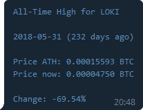

**Alternative commands**  
None  

**Description**  
Show informations about the highest price ever reached. Including the date, the price (in a specifiable currency) and past days since ATH.

**Syntax**  
`/ath <symbol>(-<target symbol>,[...])`  

**Examples**  
Get All Time High price for ETH  
`/ath eth`  
Get All Time High price for ETH in BTC  
`/ath eth-btc`  
Get All Time High price for ETH in BTC and XRP  
`/ath eth-btc,xrp`  

## `/best`

**Alternative commands**  
None

**Description**  
Show best movers for hour or day by change of price in %.

**Syntax**  
`/best hour [or] day (<# of entries>) (<min. volume>)`

**Examples**  
Show best performing coins (default is 10 coins for last hour)
`/best`  
Show 10 best performing coins for last hour  
`/best hour`  
Show 20 best performing coins for last 24 hours  
`/best day 20`  
Show 30 best performing coins in the last hour that had a volume of at least 1 million  
`/best hour 30 1000000`  

## `/bpmn`

**Alternative commands**  
None

**Description**  
Show a BPMN diagram for the given command. This will give you an understanding which APIs the command is calling and how the command words internally.

**Syntax**  
`/bpmn <command>`

**Examples**  
Show BPMN diagram for `/p` command  
`/bpmn p`  

## `/ch`

**Alternative commands**  
`/change`  

**Description**  
Show the price change of a cryptocurrency over time (day, week, month and year) in target currency. Target currency can be:

- BTC
- ETH
- LTC
- BCH
- BNB
- EOS
- XRP
- XLM
- And most fiat currencies

**Syntax**  
`/ch <symbol>(-<target symbol>)`

**Examples**  
Show price change over time for XMR (default target symbol is USD)  
`/ch xmr`  
Show price change over time for XMR in BTC  
`/ch xmr-btc`  

## `/comp`

**Alternative commands**  
`/compare`  

**Description**  
Show link to [Coinlib](https://coinlib.io) to compare the given cryptocurrencies.

**Syntax**  
`/comp <symbol> <symbol> [...]`

**Examples**  
Show link to compare XMR, DASH and DERO  
`/comp xmr dash dero`  

## `/cs`

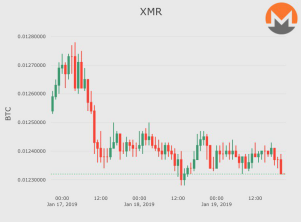

**Alternative commands**  
`/candle`  
`/candlestick`  

**Description**  
Show a candlestick diagram for a given cryptocurrency and a given timeframe.

**Syntax**  
`/cs <symbol>(-<target symbol>) (<timeframe>m[or]h[or]d)`

**Examples**  
Show candlestick chart for XMR (default timeframe is 3 days)  
`/cs xmr`  
Show candlestick chart for XMR in XRP  
`/cs xmr-xrp`  
Show candlestick chart for XMR in XRP for last 90 days  
`/cs xmr-xrp 90d`  
Show candlestick chart for XMR for last 60 minutes  
`/cs xmr 60m`  

## `/c`

**Alternative commands**  
`/chart`  

**Description**  
Show a price and volume chart for the given timeframe.

**Syntax**  
`/c <symbol>(-<target symbol>) (<# of days>)`

**Examples**  
Show chart for XMR  
`/c xmr`  
Show chart for XMR in XRP  
`/c xmr-xrp`  
Show chart for XMR in XRP for last 90 days  
`/c xmr-xrp 90`  

## `/de`

**Alternative commands**  
`/decentralization`  

**Description**  
Show information about how decentralized a coin is.

**Syntax**  
`/de <symbol>`

**Examples**  
Decentralization info for LOKI 
`/de loki`  

## `/des`

**Alternative commands**  
`/description`  

**Description**  
Show description for a given cryptocurrency.

**Syntax**  
`/des <symbol>`

**Examples**  
Show description for LOKI 
`/des loki`  

## `/dev`

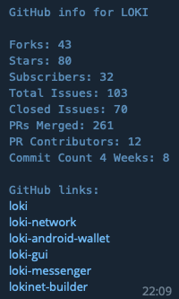

**Alternative commands**  
`/developer`  

**Description**  
Show development and source code related GitHub info for given cryptocurrency.  

**Syntax**  
`/dev <symbol>`

**Examples**  
Show development related info for LOKI  
`/dev loki`  

## `/donate`

**Alternative commands**  
None  

**Description**  
Shows other commands that allow the user to see QR-Codes for donation wallets (donations to the developer of this bot).

**Syntax**  
`/donate`

**Examples**  
Show all available donation options  
`/donate`  
Show QR-Code for Bitcoin donation address  
`/donateBTC`  
Show QR-Code for Bitcoin Cash donation address  
`/donateBCH`  
Show QR-Code for Ethereum donation address  
`/donateETH`  
Show QR-Code for Monero donation address  
`/donateXMR`  

## `/ev`

**Alternative commands**  
`/events`  

**Description**  
Show a list of global crypto events. It's possible to specify the event type, the country, the maximum number of entries and from / to date.

**Syntax**  
`/ev (limit=<# of events>) (country_code=DE|US|[...]) (type=Event|Conference|Meetup) (from_date=<date>) (to_date=<date>)`

**Examples**  
Show events 
`/ev`  
Show eight events 
`/ev limit=8`  
Show events in germany
`/ev country_code=DE`  
Show only conferences
`/ev type=Conference`  
Show only events from date to date
`/ev from_date=2019-06-28 to_date=2019-07-28`  
Show two meetups in germany 
`/ev type=Meetup country_code=DE`  

## `/ex`

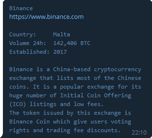

**Alternative commands**  
`/exchange`  

**Description**  
Show the description for a given exchange or show a toplist for exchanges based on trading volume per day.

**Syntax**  
`/ex <exchange> [or] top=<# of exchanges>`

**Examples**  
Show info about Binance  
`/ex binance`  
Show top 10 exchanges by 24h volume  
`ex top=10`  

## `/feedback`

**Alternative commands**  
None

**Description**  
Provide your feedback, bug reports, feature requests or anything else you want to tell me, for this bot.

**Syntax**  
`/feedback <some text>`

**Examples**  
Send me some positive feedback :-)  
`/feedback hey bro, really like your bot!`  

## `/g`

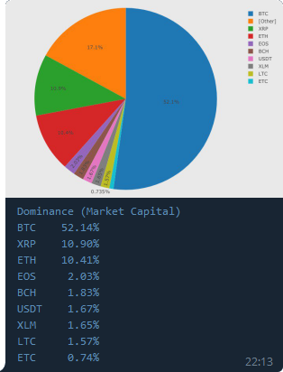

**Alternative commands**  
`/global`  

**Description**  
Get info about global dominance, volume and market capitalization.

**Syntax**  
`/g mcap [or] vol [or] dom`

**Examples**  
Show global crypto market capitalization  
`/g mcap`  
Show global crypto market volume  
`/g vol`  
Show global crypto market dominance  
`/g dom`  

## `/help`

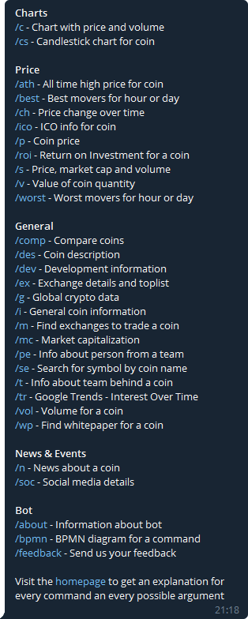

**Alternative commands**  
`/h`  

**Description**  
Returns a list of all available commands sorted by category.

**Syntax**  
`/help`

**Examples**  
Show all available commands  
`/help`  

## `/ico`

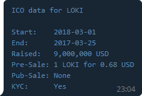

**Alternative commands**  
None  

**Description**  
Show info about the ICO of a cryptocurrency.

**Syntax**  
`/ico`

**Examples**  
Show ICO info  
`/ico`  

## `/i`

**Alternative commands**  
`/info`  

**Description**  
Show general cryptocurrency specs.

**Syntax**  
`/i <symbol>`

**Examples**  
Show info about XMR  
`/i xmr`  

## `/man`

**Alternative commands**  
`/manual`  

**Description**  
Show informations about how to use a command.

**Syntax**  
`/man <command>`

**Examples**  
Show manual for the `/p` command  
`/man /p`  

## `/mc`

**Alternative commands**  
`/mcap`  

**Description**  
Show market capitalization of specific cryptocurrency or a toplist (max 100 currencies).

**Syntax**  
`/mc <symbol>(-<target symbol>) [or] top=<# of currencies>`

**Examples**  
Show market cap for XMR  
`/mc xmr`  
Show market cap for XMR in BTC  
`/mc xmr-btc`  
Show top 10 currencies by market cap  
`/mc top=10`  

## `/m`

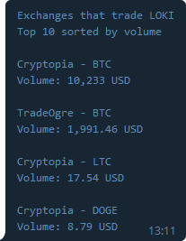

**Alternative commands**  
`/market`  

**Description**  
Show exchanges that trade specified cryptocurrency or show top 10 trading pairs (with exchange) by volume for the cryptocurrency.

**Syntax**  
`/m <symbol> (vol)`

**Examples**  
Show where to trade XMR  
`/m xmr`  
Show top 10 trading pairs for XMR  
`/m xmr vol`  

## `/n`

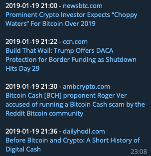

**Alternative commands**  
`/news`  

**Description**  
Show latest crypto news or show news filtered by cryptocurrency and / or by one of these filters:

- rising
- hot
- bullish
- bearish
- important
- saved
- lol

**Syntax**  
`/n (<symbol>) (filter=<filter>)`

**Examples**  
Show current news (default is no filter and no currency)  
`/n`  
Show news for XMR  
`/n xmr`  
Show news for XMR and add filter 'hot'  
`/n xmr filter=hot`  
Show news for filter 'lol' (not currency specific)  
`/n filter=lol`  

## `/pe`

**Alternative commands**  
`/people`  

**Description**  
Show info about people in the crypto business. To get to know the names, use the `/t` command. There you will also have direct links to team members.

**Syntax**  
`/pe <forename>-<surname>`

**Examples**  
Show info about Vitalik Buterin  
`/pe vitalik-buterin`  
Show info about Wladimir J. van der Laan  
`/pe wladimir-j-van-der-laan`  

## `/p`

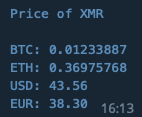

**Alternative commands**  
`/price`  

**Description**  
Show current price for given cryptocurrency. Per default, the price will be shown in `BTC`, `ETH`, `USD` and `EUR` but it's also possible to show the price in one of the supported currencies:

- BTC
- ETH
- LTC
- BCH
- BNB
- EOS
- XRP
- XLM
- And most fiat currencies

This command can also be used in [inline mode](https://core.telegram.org/bots/inline).

**Syntax**  
Regular  
`/p <symbol>(-<target symbol>,[...]) (<exchange>)`  
Inline mode  
`@opencryptobot /p <symbol>(-<target symbol>,[...]).`  

**Examples**  
Show price for XMR  
`/p xmr`  
Show price for XMR on Binance exchange  
`/p xmr binance`  
Show price for XMR in EOS  
`/p xmr-eos`  
Show price for XMR in ETH on Binance  
`/p xmr-eth binance`  
Show price for XMR in XRP, XLM and LTC  
`/p xmr-xrp,xlm,ltc`  
Show price for XMR (inline mode)  
`@opencryptobot /p xmr.`  
Show price for XMR in EOS (inline mode)  
`@opencryptobot /p xmr-eos.`  
Show price for XMR in XRP, XLM and LTC (inline mode)  
`@opencryptobot /p xmr-xrp,xlm,ltc.`  

## `/re`

**Alternative commands**  
`/repeat`  
`/timer`

**Description**  
Send specified commands periodically.

**Syntax**  
`/re i=<interval>s|m|h|d <command> | list`  

**Examples**  
Send the price of BTC every hour  
`/re i=1h /p btc`  
List all currently active repeaters  
`/re list`  

## `/restart`  (only for bot admins)

**Alternative commands**  
None  

**Description**  
Restart the bot. This will only work if you are the owner of the bot.

**Syntax**  
`/restart`  

**Examples**  
Restart the bot  
`/restart`  

## `/roi`

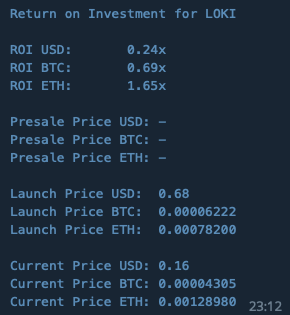

**Alternative commands**  
None  

**Description**  
Show Return on Investment for a cryptocurrency. Will only work if the cryptocurrency had an ICO.  

**Syntax**  
`/roi <symbol>`  

**Examples**  
Show Return on Investment for LOKI  
`/roi loki`  

## `/se`

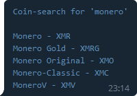

**Alternative commands**  
`/search`  

**Description**  
Find all cryptocurrencies (with symbol) for the given search-string  

**Syntax**  
`/se <coin name>`  

**Examples**  
Search for the symbol of Monero  
`/se monero`  

## `/shutdown` (only for bot admins)

**Alternative commands**  
None  

**Description**  
Shutdown the bot. This will only work if you are the owner of the bot.

**Syntax**  
`/shutdown`  

**Examples**  
Shutdown the bot  
`/shutdown`  

## `/soc`

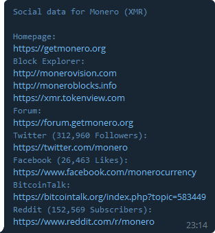

**Alternative commands**  
`/social`  

**Description**  
Show all available social media platforms with links and followers / likes if available.

**Syntax**  
`/soc <symbol>`  

**Examples**  
Show social media for XMR  
`/soc xmr`  

## `/s`

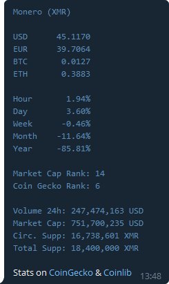

**Alternative commands**  
`/stats`  

**Description**  
Show summary for a cryptocurrency to get a general idea about it.

**Syntax**  
`/s <symbol>`  

**Examples**  
Show summary LOKI  
`/s loki`  

## `/top`

**Alternative commands**  
None  

**Description**  
Show top 30 coins with current price and sorted by market capital.

**Syntax**  
`/top (<target symbol>)`  

**Examples**  
Show top 30 coins in USD
`/top`  
Show top 30 coins in EUR
`/top eur`  

## `/tr`

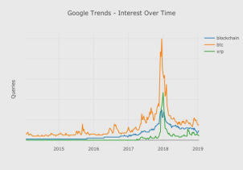

**Alternative commands**  
`/trend`  

**Description**  
Get *Interest Over Time* chart from Google Trends for a set of given keywords and a timeframe.

**Syntax**  
`/tr <keyword> (<keyword> [...] t=<# of days/months/years>d[or]m[or]y[or]all)`  

**Examples**  
Show interest over time for keyword 'blockchain'  
`/tr blockchain`  
Show comparison of interest over time for a list of keywords  
`/tr blockchain bitcoin litecoin`  
Show interest over time for keyword 'blockchain' for the last 30 days  
`/tr blockchain t=30d`  
Show comparison of interest over time for a list of keywords for last 5 years  
`/tr blockchain bitcoin litecoin t=5y`  
Show interest over time for keyword 'blockchain' and whole available timeframe  
`/tr blockchain t=all`  

## `/t`

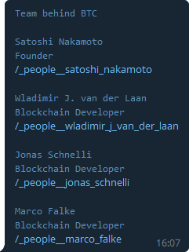

**Alternative commands**  
`/team`  

**Description**  
List people that are working on a project with their role and a link to the `/pe` command to get details about a team member.

**Syntax**  
`/t <symbol>`  

**Examples**  
Show people that are working on BTC  
`/t btc`  

## `/tw`

**Alternative commands**  
`/twitter`  

**Description**  
Return last three Tweets for a Twitter account.

**Syntax**  
`/tw <symbol>`  

**Examples**  
Show latest Tweets for LOKI  
`/tw LOKI`  

## `/update`
**(only for bot admins)**

**Alternative commands**  
None  

**Description**  
Update the bot to the latest release version, to a specific release, to a specific branch name or just check if a new version (latest release) is available.

**Syntax**  
`/update (relase=<release tag> [or] branch=<branch name> [or] check)`  

**Examples**  
Update bot to latest release  
`/update`  
Update bot to release 0.1.0  
`/update release=0.1.0`  
Update bot to latest version of branch 'master'  
`/update branch=master`  
Check if an update is available  
`/update check`  
Check if a new release update is available  
`/update release check`  
Check if a new branch update is available  
`/update branch check`  

## `/v`

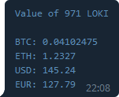

**Alternative commands**  
`/value`  

**Description**  
Show the value of specific cryptocurrency quantity in `BTC`, `ETH`, `USD` and `EUR` or the specified currency.

**Syntax**  
`/v <symbol>(-<target symbol>,[...]) <quantity>`  

**Examples**  
Show value of 971 LOKI coins in default currencies  
`/v loki 971`  
Show value of 1500 XRP coins in XLM  
`/v xrp-xlm 1500`  
Show value of 1500 XRP coins in XLM and EUR  
`/v xrp-xlm,eur 1500`  

## `/vol`

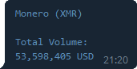

**Alternative commands**  
`/volume`  

**Description**  
Show total volume for a cryptocurrency or volume toplist (max 100 currencies).

**Syntax**  
`/vol <symbol>(-<target symbol>) [or] top=<# of currencies>`  

**Examples**  
Show volume for LOKI  
`/vol loki`  
Show volume for LOKI in BTC  
`/vol loki-btc`  
Show top 10 currencies by total volume  
`/vol top=10`  

## `/worst`

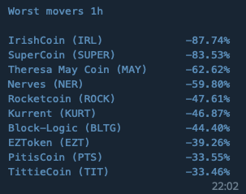

**Alternative commands**  
None  

**Description**  
Show worst movers for hour or day by change of price.  

**Syntax**  
`/worst (hour[or]day <# of entries> <min. volume>)`  

**Examples**  
Show worst performing coins (default is 10 coins for last hour)  
`/worst`  
Show 10 worst performing coins for last hour  
`/worst hour`  
Show 20 worst performing coins for last 24 hours  
`/worst day 20`  
Show 30 worst performing coins in the last hour that had a volume of at least 1 million  
`/worst hour 30 1000000`  

## `/wp`

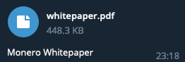

**Alternative commands**  
`/whitepaper`  

**Description**  
Download the whitepaper of a given cryptocurrency. If no whitepaper can be found then there is the possibility to add a keyword to search an additional source.  

**Syntax**  
`/wp <symbol> (all)`  

**Examples**  
Download whitepaper for XMR  
`/wp xmr`  
Download whitepaper for BCH and search in additional source  
`/wp bch all`  