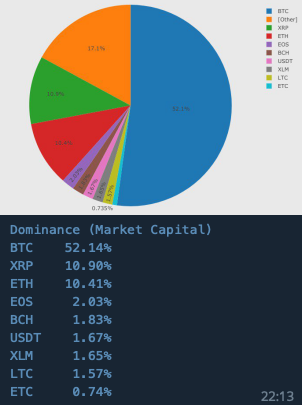
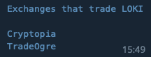

# Available commands

[TODO] Explain what exactely the syntax means  
Following commands are available

[/about](#about) - About the bot  
[/ath](#ath) - All Time High  
[/best](#best) - Best movers  
[/bpmn](#bpmn) - Command diagrams  
[/cs](#cs) - Candlestick chart  
[/ch](#ch) - Price Change  
[/c](#c) - Price and Volume chart  
[/comp](#comp) - Compare currencies  
[/des](#des) - Currency description  
[/dev](#dev) - Development info  
[/donate](#donate) - Donate to bot development  
[/ex](#ex) - Exchange details & toplist  
[/feedback](#feedback) - Feedback  
[/g](#g) - Global stats  
[/help](#help) - List available commands  
[/ico](#ico) - Initial Coin Offering  
[/i](#i) - General coin info  
[/m](#m) - List coin markets  
[/n](#n) - Crypto news  
[/pe](#pe) - People in crypto  
[/p](#p) - Current price  
[/restart](#restart) - Restart bot  
[/roi](#roi) - Return on Investment  
[/se](#se) - Coin search  
[/shutdown](#shutdown) - Shutdown bot  
[/soc](#soc) - Social links and stats  
[/s](#s) - Currency stats  
[/t](#t) - Team details  
[/tr](#tr) - Google Trends  
[/update](#update) - Update bot  
[/v](#v) - Value of coin quantity  
[/wp](#wp) - Whitepaper download  
[/worst](#worst) - Worst movers  

## `/about`

**Alternative commands**  
None

**Description**  
Shows information about the author / developer  of this Telegram bot and about the bot itself.

**Syntax**  
`/about`

**Examples**  
`/about`

## `/ath`

**Alternative commands**  
None  

**Description**  
Shows information about the highest price ever reached. Including the date, the price (in a specifiable currency) and pasted days since ATH.

**Syntax**  
`/ath <symbol> (<target symbol>)`  

**Examples**  
`/ath eth`  
`/ath eth btc`  

## `/best`

**Alternative commands**  
None

**Description**  
Shows the best movers for hour or day by change of price.

**Syntax**  
`/best hour | day (<# of entries>) (<min. volume>)`

**Examples**  
Show 10 best performing coins for last hour  
`/best hour`  
Show 20 best performing coins for last 24 hours  
`/best day 20`  
Show 30 best performing coins in the last hour that had a volume of at least 1 million  
`/best hour 30 1000000`  

## `/bpmn`

**Alternative commands**  
None

**Description**  
Shows a BPMN diagram for the given command.

**Syntax**  
`/bpmn <command>`

**Examples**  
Show BPMN diagram for `/p` command  
`/bpmn p`  

## `/cs`

**Alternative commands**  
`/candle`  
`/candlestick`  

**Description**  
Shows a candlestick diagram for a given coin and a given timeframe.

**Syntax**  
`/cs (<target symbol>-)<symbol> (<timeframe>m|h|d)`

**Examples**  
Show candlestick chart for `XMR`  
`/cs xmr`  
Show candlestick chart for `XMR` in `XRP`  
`/cs xrp-xmr`  
Show candlestick chart for `XMR` in `XRP` for last 90 days  
`/cs xrp-xmr 90d`  

## `/ch`

**Alternative commands**  
`/change`  

**Description**  
Show the price change of a coin over time (day, week, month and year).

**Syntax**  
`/ch <symbol>`

**Examples**  
Show all time high price for `XMR`  
`/ch xmr`  

## `/c`

**Alternative commands**  
`/chart`  

**Description**  
Show a price and volume chart for the given timeframe.

**Syntax**  
`/c (<vs symbol>-)<symbol> (<# of days>)`

**Examples**  
Show chart for `XMR`  
`/c xmr`  
Show chart for `XMR` in `XRP`  
`/c xrp-xmr`  
Show chart for `XMR` in `XRP` for last 90 days  
`/c xrp-xmr 90`  

## `/comp`

**Alternative commands**  
`/compare`  

**Description**  
Show link to Coinlib to compare the given coins.

**Syntax**  
`/comp <symbol> <symbol> ...`

**Examples**  
Show link to Coinlib website to compare `XMR`, `DASH` and `DERO`  
`/comp xmr dash dero`  

## `/des`

**Alternative commands**  
`/description`  

**Description**  
Show short overview / description for a given coin.

**Syntax**  
`/des <symbol>`

**Examples**  
Show description for given coin  
`/des loki`  

## `/dev`

**Alternative commands**  
`/developer`  

**Description**  
Show development and source code related info for given coin

**Syntax**  
`/dev <symbol>`

**Examples**  
Show development related info for given coin  
`/dev loki`  

## `/donate`

**Alternative commands**  
None  

**Description**  
Shows other commands that allow the user to see QR-Code of donation address wallets.

**Syntax**  
`/donate`

**Examples**  
Show all available donation options  
`/donate`  
Show QR-Code for Bitcoin donation address  
`/donateBTC`  
Show QR-Code for Bitcoin Cash donation address  
`/donateBCH`  
Show QR-Code for Ethereum donation address  
`/donateETH`  
Show QR-Code for Monero donation address  
`/donateXMR`  

## `/ex`

**Alternative commands**  
`/exchange`  

**Description**  
Show description for given exchange along with:  

- Link
- Country
- Year of creation
- Volume (24h)

This command can also be used to show a toplist based on volume for all available exchanges.

**Syntax**  
`/ex <exchange> | top=<# of exchanges>`

**Examples**  
Show info about Binance  
`/ex binance`  
Show top 10 exchanges by 24h volume  
`ex top=10`  

## `/feedback`

**Alternative commands**  
None

**Description**  
Provide your feedback, bugreports, feature-requests for this bot.

**Syntax**  
`/feedback <some text>`

**Examples**  
Send me some positive feedback :-)  
`/feedback hey bro, really like your bot!`  

## `/g`

**Alternative commands**  
`/global`  

**Description**  
Get info about global dominance, global volume and global market capitalization and also global volume and global market capitalization for a specific coin.

**Syntax**  
`/g mcap (<coin>) | vol (<coin>) | dom`

**Examples**  
Show global crypto market capitalization  
`/g mcap`  
Show market capitalization for a coin  
`/g mcap btc`  
Show global crypto market volume  
`/g vol`  
Show volume for a coin  
`/g vol btc`  
Show global crypto market dominance (percentage)  
`/g dom`  

## `/help`

**Alternative commands**  
`/h`  

**Description**  
Returns a list of all available commands sorted by category.

**Syntax**  
`/help`

**Examples**  
Show all available commands  
`/help`  

## `/ico`

**Alternative commands**  
None  

**Description**  
Show info about the ICO of a coin if there was one.

**Syntax**  
`/ico`

**Examples**  
Show ICO info  
`/ico`  

## `/i`

**Alternative commands**  
`/info`  

**Description**  
Show general coin specs.

**Syntax**  
`/i <symbol>`

**Examples**  
Show info about a coin  
`/i xmr`  

## `/m`

**Alternative commands**  
`/market`  

**Description**  
Show exchanges that trade specified coin or show top 10 exchanges by volume that trade the coin.

**Syntax**  
`/m <symbol> (vol)`

**Examples**  
Show where to trade a coin  
`/m xmr`  
Show top 10 trading pairs (and corresponding exchanges) sorted by volume  
`/m xmr vol`  

## `/n`

**Alternative commands**  
`/news`  

**Description**  
Show latest crypto news or show news filtered by coin and / or by one of these filters:

- rising
- hot
- bullish
- bearish
- important
- saved
- lol

**Syntax**  
`/n (<symbol>) (filter=<filter>)`

**Examples**  
Show current news  
`/n`  
Show news for coin  
`/n xmr`  
Show news for coin and add a filter  
`/n xmr filter=hot`  
Show news for a given filter  
`/n filter=lol`  

## `/pe`

**Alternative commands**  
`/people`  

**Description**  
Show info about people in the crypto business

**Syntax**  
`/pe <forename>-<surname>`

**Examples**  
Show info about Vitalik Buterin  
`/pe vitalik-buterin`  
Show info about Wladimir J. van der Laan  
`/pe wladimir-j-van-der-laan`  

## `/p`

**Alternative commands**  
`/price`  

**Description**  
Show current price for given coin. Per default, the price of the given coin will be shown in `BTC`, `ETH`, `USD` and `EUR` but it's also possible to show the price in one of the supported currencies:

- BTC
- ETH
- LTC
- BCH
- BNB
- EOS
- XRP
- XLM
- And most fiat currencies

**Syntax**  
Regular chat with bot  
`/p (<target symbol>,<target symbol>, ...)-<symbol>`  
Experimental inline mode  
`@opencryptobot /p (<target symbol>,<target symbol>, ...)-<symbol>.`  

**Examples**  
Show price for a coin  
`/p xmr`  
Show price for a coin in specified currency  
`/p eos-xmr`  
Show price for a coin in list of specified currencies  
`/p xrp,xlm,ltc-xmr`  
Show price for a coin (inline mode)  
`@opencryptobot /p xmr.`  
Show price for a coin in specified currency (inline mode)  
`@opencryptobot /p eos-xmr.`  
Show price for a coin in list of specified currencies (inline mode)  
`@opencryptobot /p xrp,xlm,ltc-xmr.`  

## `/restart`

**Alternative commands**  
None  

**Description**  
Restart the bot. This will only work if you are the owner of the bot.

**Syntax**  
`/restart`  

**Examples**  
Restart the bot  
`/restart`  

## `/roi`

**Alternative commands**  
None  

**Description**  
Show Return on Investment for given coin. Will only work if the coin had an ICO.  

**Syntax**  
`/roi <symbol>`  

**Examples**  
Show Return on Investment for a coin  
`/roi loki`  

## `/se`

**Alternative commands**  
`/search`  

**Description**  
Find all coins (with symbol) for the given search-string  

**Syntax**  
`/se <coin name>`  

**Examples**  
Search for the symbol of a coin  
`/se monero`  

## `/shutdown`

**Alternative commands**  
None  

**Description**  
Shutdown the bot. This will only work if you are the owner of the bot.

**Syntax**  
`/shutdown`  

**Examples**  
Shutdown the bot  
`/shutdown`  

## `/soc`

**Alternative commands**  
`/social`  

**Description**  
Show all available social media platforms with links and followers / likes if available.

**Syntax**  
`/soc <symbol>`  

**Examples**  
Show social media for a coin  
`/soc xmr`  

## `/s`

**Alternative commands**  
`/stats`  

**Description**  
Show summary for a coin. Including:

- Price in `USD`, `EUR`, `BTC` and `ETH`
- Price change for hour, day, week, month and year
- Ranks on different websites
- Volume (24h)
- Market capitalization

**Syntax**  
`/s <symbol>`  

**Examples**  
Show summary for a coin  
`/s loki`  

## `/t`

**Alternative commands**  
`/team`  

**Description**  
List people that are working on a project with their role and a link to the `/pe` command to get details about a team member.

**Syntax**  
`/t <symbol>`  

**Examples**  
Show summary for a coin  
`/t btc`  

## `/tr`

**Alternative commands**  
`/trend`  

**Description**  
List people that are working on a project with their role and a link to the `/pe` command to get details about a team member.

**Syntax**  
`/tr <keyword> (<keyword> ... t=<# of>d|m|y)`  

**Examples**  
Show interest over time for a given keyword  
`/tr blockchain`  
Show comparison of interest over time for the provided keywords  
`/tr blockchain bitcoin litecoin`  
Show interest over time for a given keyword  for the last 30 days  
`/tr blockchain t=30d`  
Show comparison of interest over time for the provided keywords for 5 years  
`/tr blockchain bitcoin litecoin t=5y`  

## `/update`

**Alternative commands**  
None  

**Description**  
Update the bot to the latest release version, to a specific release, to a specific branch name or just check if a new version is available.

**Syntax**  
`/update (relase=<release tag> | branch=<branch name> | check)`  

**Examples**  
Update bot to latest release  
`/update`  
Update bot to specific release  
`/update release=0.1.0`  
Update bot to latest version of specific branch  
`/update branch=master`  
Check if an update is available  
`/update check`  
Check if a new release update is available  
`/update release check`  
Check if a new branch update is available  
`/update branch check`  

## `/v`

**Alternative commands**  
`/value`  

**Description**  
Show the value of specific coin quantity in `BTC`, `ETH`, `USD` and `EUR` or the specified coin.

**Syntax**  
`/v <symbol> <quantity> (<target symbol>)`  

**Examples**  
Show value of 971 LOKI coins in default currencies  
`/v loki 971`  
Show value of 1500 XRP coins in XLM  
`/v xrp 1500 xlm`  

## `/wp`

**Alternative commands**  
`/whitepaper`  

**Description**  
Download the whitepaper of a given coin. If no whitepaper can be found then there is the possibility to add a keyword to search an additional source.  

**Syntax**  
`/wp <symbol> (all)`  

**Examples**  
Download whitepaper for XMR  
`/wp xmr`  
Download whitepaper for BCH and search an additional source  
`/wp bch all`  

## `/worst`

**Alternative commands**  
None  

**Description**  
Shows the worst movers for hour or day by change of price.  

**Syntax**  
`/worst hour|day (<# of entries> <min. volume>)`  

**Examples**  
Show 10 worst performing coins for last hour  
`/worst hour`  
Show 20 worst performing coins for last 24 hours  
`/worst day 20`  
Show 30 worst performing coins in the last hour that had a volume of at least 1 million  
`/worst hour 30 1000000`  